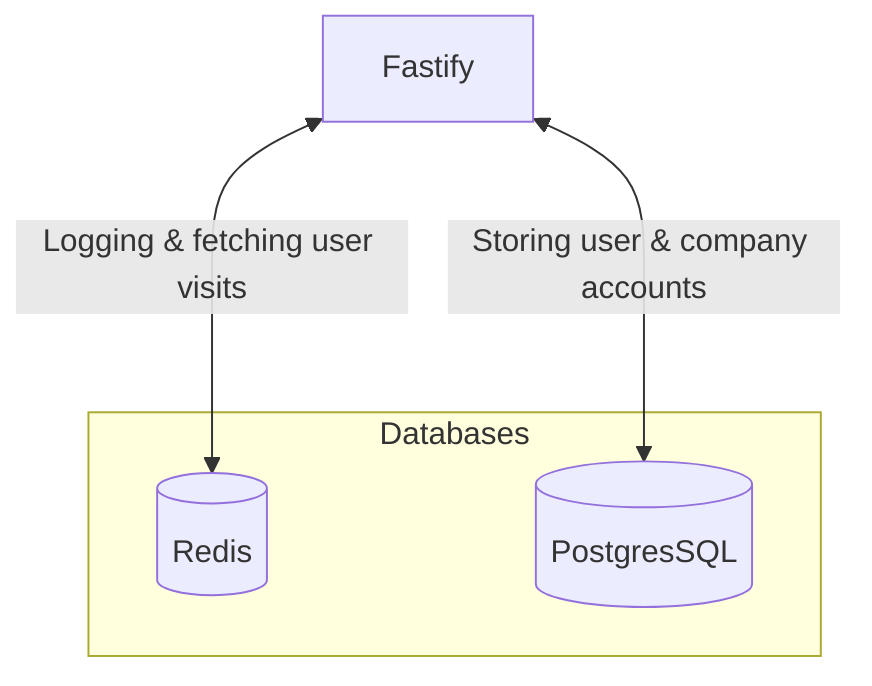

# Architectures
## Fastify + Postgres + Redis

This architectures directs the logging of user visits to the Redis database and stores the profiles of the users and companies in the PostgesSQL databases

### Benefits

- :white_check_mark: Redis is build for ingesting high amount of traffic in a short time. When the usage of the application starts to scale, the logging of the visits will increase a lot more then the changing of profile information. By seperating this, we can ensure that the database for storing account information doesn't get overloaded in case of traffic spikes
- :white_check_mark: This architecture is a microsirvice structure by nature and allows us to update or change each component seperatly

### Downsides

- :x: Because we are using 2 databases, the development of it might be more complex in comparision to other architectures
- :x: The responsibility of creating relations between the data is a responsibility for the back-end server now. This might increase the load that the server would recieve and could slow down response times

## Fastify + PostgresSQL

### Benefits

- :white_check_mark: In comparision with the previous architecture, this one is more simple and could be less effort to maintain
- :white_check_mark: The initial running costs could be lower then the other architecture 

### Downsides
- :x: When scaling up, the costs could quickly escalate depending on the impact of the logging of the company visits
