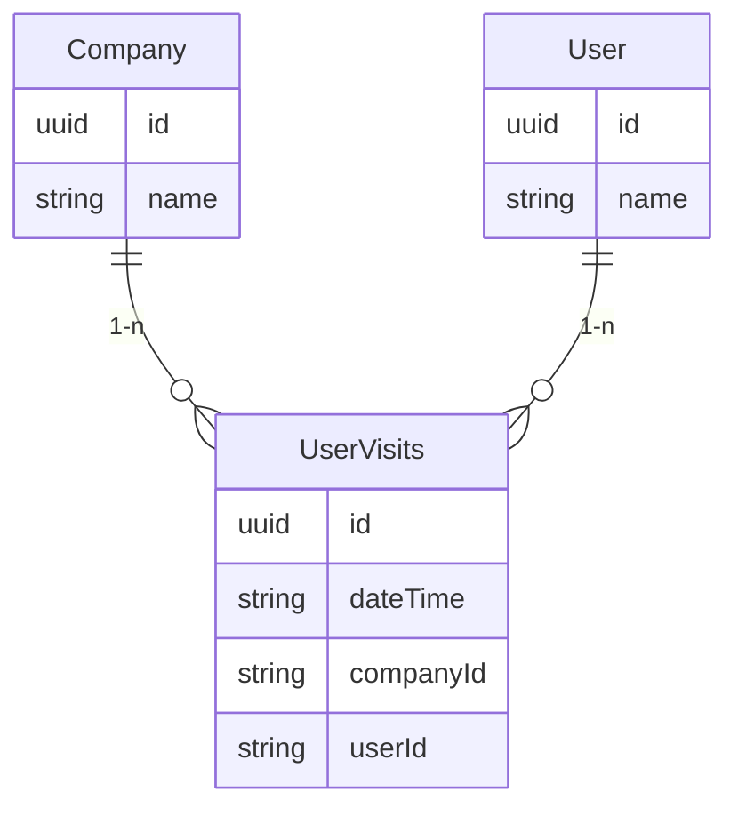

# Database structure

The database structure inserted looks like this:

The `UserVisits` contains the logged visits, where 1 entry references 1 `companyId` *(The target)*, `1 userId` *(The visitor)* and the `dateTime` *(The timestamp)* in order to be able to know when the user visited.
